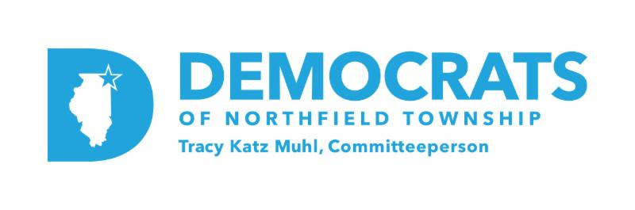

::: {style="text-align: center;"}
{width=500px}
:::
# Northfield Township Post-Primary Review
::: {style="font-size: 1.2em;"}
By **Drew Duffy**  
March 23, 2026
:::
---

> **Internal Document — For Democrats of Northfield Township Leadership Only**  
> *Do not share, distribute, or reproduce without authorization.*

---
```{r setup}
library(tidyverse)
library(sf)
library(showtext)
library(tigris)
library(ggtext)

font_add_google("EB Garamond", "garamond")
showtext_auto()

# load data
results <- read_csv("northfield_results_tidy.csv") |> 
  filter(!is.na(precinct_num)) |>
  filter(!(race == "Committeeperson Dem State Central 10th" & precinct_num == 20))

# load shapefile
precincts <- st_read("Precinct.shp", quiet = TRUE)

northfield_precincts <- precincts |> 
  filter(Township_N == "NORTHFIELD") |> 
  mutate(precinct_num = as.numeric(Precinct_N))

# roads
options(tigris_use_cache = TRUE)
roads <- roads("IL", "Cook", progress_bar = FALSE)
roads <- st_transform(roads, st_crs(northfield_precincts))
nf_boundary <- st_union(northfield_precincts)
roads_nf <- st_intersection(roads, nf_boundary)
```

```{r map-theme}
# standardized map theme function
map_theme <- function() {
  theme_void() +
    theme(
      plot.background = element_rect(fill = "white", color = NA),
      panel.background = element_rect(fill = "white", color = NA),
      plot.title = element_text(color = "black", family = "garamond",
                                size = 18, face = "bold", hjust = 0,
                                margin = margin(b = 5)),
      plot.subtitle = element_text(color = "black", family = "garamond",
                                   size = 12, hjust = 0, lineheight = 1.4,
                                   margin = margin(b = 5)),
      plot.caption = element_text(color = "black", family = "garamond",
                                  size = 10, hjust = 0,
                                  margin = margin(t = 5)),
      strip.text = element_text(color = "black", family = "garamond",
                                size = 10, face = "bold",
                                margin = margin(t = 12, b = 10)),
      plot.title.position = "plot",
      plot.caption.position = "plot",
      panel.spacing = unit(1.5, "cm"),
      legend.text = element_text(color = "black", family = "garamond"),
      legend.title = element_text(color = "black", family = "garamond", size = 10),
      plot.margin = margin(10, 15, 10, 15)
    )
}

# standardized colorbar guide
std_colorbar <- function() {
  guide_colorbar(
    barheight = unit(6, "cm"),
    barwidth = unit(0.4, "cm"),
    ticks = FALSE
  )
}
```

March 17, 2026, was Illinois's most consequential primary election in decades, and this was especially true in Northfield Township. Two political giants, Senator Dick Durbin and Congresswoman Jan Schakowsky, stepped aside after holding their seats since 1996 and 1998 respectively. The 9th State Senate District also saw its first open, contested primary since 1976. This was a once-in-a-generation ballot that gave voters the opportunity to weigh in on offices they may have never had a real say in filling.

Given the breadth and depth of the field, this primary was a unique bellwether of the Democrats of Northfield Township’s ability to mobilize voters on behalf of their endorsed candidates. This report analyzes precinct-level results across eleven contested races, mapping where endorsed candidates performed strongly, where they fell short, and what the geography of this primary tells us about Northfield Township going forward. 

## Federal Races

The U.S. Senate race was the marquee contest of the March primary. Statewide, Stratton prevailed with 40.2% of the vote, buoyed by a surprisingly strong showing downstate and a commanding performance in Chicago, where she took 44% over Robin Kelly’s 25% and Krishnamoorthi’s 23%. In Suburban Cook County, Stratton won narrowly with 36% compared to Krishnamoorthi’s 35% and Kelly’s 21%. 

In Northfield Township, Raja Krishnamoorthi won 44.8% to Juliana Stratton’s 40.0%, with Robin Kelly a distant third at 9.4%. Krishnamoorthi carried 34 of the township's 58 precincts to Stratton's 24. Among neighboring townships, Krishnamoorthi won Wheeling by 11.7 points, Maine by 8.3, New Trier by 6.1 points, and Niles by 1.6 points. 

```{r senate-map}
senate_two <- results |> 
  filter(race == "US Senate",
         candidate %in% c("Juliana Stratton", "Raja Krishnamoorthi"))

senate_winner_two <- senate_two |> 
  group_by(precinct_num) |> 
  mutate(margin = vote_share - min(vote_share)) |> 
  slice_max(votes, n = 1, with_ties = FALSE) |> 
  mutate(margin_dir = ifelse(candidate == "Juliana Stratton", margin, -margin)) |> 
  ungroup()

map_data_two <- northfield_precincts |> 
  left_join(senate_winner_two, by = "precinct_num")

ggplot() +
  geom_sf(data = roads_nf, color = "grey60", linewidth = 0.15) +
  geom_sf(data = map_data_two, aes(fill = margin_dir),
          color = "black", linewidth = 0.2, alpha = 0.85) +
  geom_sf_text(data = map_data_two, aes(label = precinct_num), color = "black",
               family = "garamond", size = 2.5) +
  scale_fill_gradient2(
    low = "#00C957", mid = "grey85", high = "#9B30FF",
    midpoint = 0,
    name = "Head-to-Head Margin",
    breaks = c(max(map_data_two$margin_dir, na.rm = TRUE), 0.15, 0, -0.15,
               min(map_data_two$margin_dir, na.rm = TRUE)),
    labels = c("Stratton", "+15%", "Even", "-15%", "Krishnamoorthi"),
    guide = std_colorbar()
  ) +
  labs(
    title = "United States Senator",
    subtitle = "Raja Krishnamoorthi: 44.8%  |  *Juliana Stratton: 40.0%  |  Others: 15.2%",
    caption = "* = NF Dems Endorsed  |  Source: Cook County Clerk  |  Graphic by Drew Duffy"
  ) +
  map_theme()
```

The 9th Congressional District primary was among the most closely watched races in the country this cycle, with more than a dozen Democrats vying to succeed Schakowsky. Evanston Mayor Daniel Biss ultimately won the race, edging out political newcomer Kat Abughazaleh by less than four points.

While State Senator Laura Fine came in third overall, she dominated her home turf. The Glenview native and seasoned state legislator carried 42.8% of the vote in Northfield Township, far outpacing Biss at 26.7%, Abughazaleh at 11.7%, and Phil Andrew at 11.5%. Across the township's 35 relevant within the district, Fine won 29, with Biss carrying four and Abughazaleh and Andrew each winning one. District-wide, Fine's campaign fell short, but the neighbors she has represented for the past thirteen years showed up strong for her.

```{r congressional-map, fig.width=8.5, fig.height=10}
cong_four <- results |> 
  filter(race == "9th Congressional District",
         candidate %in% c("Laura Fine", "Daniel Biss",
                          "Phil Andrew", "Kat Abughazaleh"))

cong_winner <- results |> 
  filter(race == "9th Congressional District") |> 
  group_by(precinct_num) |> 
  slice_max(votes, n = 1, with_ties = FALSE) |> 
  ungroup() |> 
  select(precinct_num, winner = candidate)

map_cong <- northfield_precincts |> 
  inner_join(cong_four, by = "precinct_num") |> 
  left_join(cong_winner, by = "precinct_num") |> 
  mutate(
    won_precinct = candidate == winner,
    candidate = factor(candidate, levels = c(
      "Laura Fine", "Daniel Biss", "Phil Andrew", "Kat Abughazaleh"
    ))
  )

ggplot(map_cong) +
  geom_sf(data = roads_nf, color = "grey60", linewidth = 0.15) +
  geom_sf(aes(fill = vote_share), color = "black", linewidth = 0.2) +
  geom_sf_text(aes(label = precinct_num), color = "black",
               family = "garamond", size = 2) +
  scale_fill_gradient(
    low = "grey90", high = "#08306B",
    labels = scales::percent,
    name = "Vote Share"
  ) +
  facet_wrap(~ candidate, ncol = 2) +
  labs(
    title = "United States Congressperson  — 9th District",
    subtitle = "*Laura Fine: 42.8%  |  Daniel Biss: 26.7%  |  Kat Abughazaleh: 11.7%  |  Phil Andrew: 11.5%  |  Others: 7.3%",
    caption = "* = NF Dems Endorsed  |  Source: Cook County Clerk  |  Graphic by Drew Duffy"
  ) +
  map_theme()
```
## Illinois Races

The race to succeed Laura Fine in the Springfield was an exceptionally close contest between two local party leaders, both of whom were endorsed by the Democrats of Northfield Township. New Trier Democrats President Patrick Hanley prevailed over DPOE Deputy Committeeperson Rachel Ruttenberg by just 1,360 votes district-wide. Hanley earned 21,557 votes to Ruttenberg's 20,197, a 3.2 point margin of victory. Had 678 Hanley voters chosen Ruttenberg instead, this race would have ended differently.

In Northfield Township, it was a virtual tie. Hanley carried the township by just 32 votes, winning 18 precincts to Ruttenberg's 13. District-wide, the results were geographically polarized. Hanley dominated New Trier Township, winning by over 40 points and carrying every precinct, and performed well in the small Maine Township portion of the district. Ruttenberg carried the district outside of New Trier, with her strongest showing in Niles Township, where she won 59.1% to 40.9%. Evanston also went to Ruttenberg, but her 2.4-point margin there proved insufficient to overcome Hanley's New Trier firewall. The Chicago portion of the district was similarly close, with Ruttenberg winning 51.7% to 48.3%.

```{r senate9-map}
senate9_two <- results |> 
  filter(race == "9th State Senate District",
         candidate %in% c("Patrick Hanley", "Rachel Ruttenberg"))

senate9_winner <- senate9_two |> 
  group_by(precinct_num) |>
  mutate(margin = vote_share - min(vote_share)) |> 
  slice_max(votes, n = 1, with_ties = FALSE) |> 
  mutate(margin_dir = ifelse(candidate == "Patrick Hanley", margin, -margin)) |> 
  ungroup()

map_senate9 <- northfield_precincts |> 
  inner_join(senate9_winner, by = "precinct_num")

ggplot() +
  geom_sf(data = roads_nf, color = "grey60", linewidth = 0.15) +
  geom_sf(data = map_senate9, aes(fill = margin_dir),
          color = "black", linewidth = 0.2, alpha = 0.85) +
  geom_sf_text(data = map_senate9, aes(label = precinct_num), color = "black",
               family = "garamond", size = 2.5) +
  scale_fill_gradient2(
    low = "#4393C3", mid = "grey85", high = "#A50026",
    midpoint = 0,
    name = "Head-to-Head Margin",
    breaks = c(max(map_senate9$margin_dir, na.rm = TRUE), 0.15, 0, -0.15,
               min(map_senate9$margin_dir, na.rm = TRUE)),
    labels = c("Hanley", "+15%", "Even", "-15%", "Ruttenberg"),
    guide = std_colorbar()
  ) +
  labs(
    title = "Illinois State Senator — 9th District",
    subtitle = "**Patrick Hanley: 50.1%  |  **Rachel Ruttenberg: 49.9%",
    caption = "** = NF Dems Dual Endorsement  |  Source: Cook County Clerk  |  Graphic by Drew Duffy"
  ) +
  map_theme()
```

The race for Illinois Comptroller showcased a battle of opposing endorsements. Statewide, Pritzker's pick prevailed: State Rep. Margaret Croke won 34.6% of the vote to Bernie-backed State Sen. Karina Villa's 32.3%, NF Dems-endorsed Lake County Treasurer Holly Kim's 24.4%, and State Rep. Stephanie Kifowit's 8.7%. This race was not called until two days after election night. In Northfield Township, Kim fell just short. The Glenbrook North alumna carried 25 precincts to Croke's 33 and lost by just 92 votes."

```{r comptroller-map}
comptroller_two <- results |> 
  filter(race == "Comptroller",
         candidate %in% c("Holly Kim", "Margaret Croke"))

comptroller_winner <- comptroller_two |> 
  group_by(precinct_num) |>
  mutate(margin = vote_share - min(vote_share)) |> 
  slice_max(votes, n = 1, with_ties = FALSE) |> 
  mutate(margin_dir = ifelse(candidate == "Holly Kim", margin, -margin)) |> 
  ungroup()

map_comptroller <- northfield_precincts |> 
  left_join(comptroller_winner, by = "precinct_num")

ggplot() +
  geom_sf(data = roads_nf, color = "grey60", linewidth = 0.15) +
  geom_sf(data = map_comptroller, aes(fill = margin_dir),
          color = "black", linewidth = 0.2, alpha = 0.85) +
  geom_sf_text(data = map_comptroller, aes(label = precinct_num), color = "black",
               family = "garamond", size = 2.5) +
  scale_fill_gradient2(
    low = "#283593", mid = "grey85", high = "#FF8F00",
    midpoint = 0,
    name = "Head-to-Head Margin",
    breaks = c(max(map_comptroller$margin_dir, na.rm = TRUE), 0.15, 0, -0.15,
               min(map_comptroller$margin_dir, na.rm = TRUE)),
    labels = c("Kim", "+15%", "Even", "-15%", "Croke"),
    guide = std_colorbar()
  ) +
  labs(
    title = "Illinois Comptroller",
    subtitle = "Margaret Croke: 40.3%  |  *Holly Kim: 39.8%  |  Karina Villa: 15.0%  |  Stephanie Kifowit: 4.9%",
    caption = "* = NF Dems Endorsed  |  Source: Cook County Clerk  |  Graphic by Drew Duffy"
  ) +
  map_theme()
```

## Cook County Races

If incumbency is becoming a liability in Democratic politics, nobody told Toni Preckwinkle. The mighty four-term Cook County Board President and Democratic Party Chair pummeled her primary challenger from the right, Chicago Alderman Brendan Reilly, by 37.3 points county-wide. In Northfield Township, Preckwinkle swept all 58 precincts, winning roughly 60% of the vote.

```{r boardpres-map}
preckwinkle <- results |> 
  filter(race == "Cook County Board President",
         candidate == "Toni Preckwinkle")

map_boardpres <- northfield_precincts |> 
  left_join(preckwinkle, by = "precinct_num")

ggplot() +
  geom_sf(data = roads_nf, color = "grey60", linewidth = 0.15) +
  geom_sf(data = map_boardpres, aes(fill = vote_share),
          color = "black", linewidth = 0.2, alpha = 0.85) +
  geom_sf_text(data = map_boardpres, aes(label = precinct_num), color = "black",
               family = "garamond", size = 2.5) +
  scale_fill_gradient(
    low = "grey90", high = "#9B30FF",
    labels = scales::percent,
    name = "Preckwinkle\nVote Share"
  ) +
  labs(
    title = "Cook County Board President",
    subtitle = "*Toni Preckwinkle: 59.6%  |  Brendan Reilly: 40.4%",
    caption = "* = NF Dems Endorsed  |  Source: Cook County Clerk  |  Graphic by Drew Duffy"
  ) +
  map_theme()
```

It was a different story a few floors down at the Cook County Building. Eight years after defeating incumbent Assessor Joe Berrios, Fritz Kaegi met the same fate. Lyons Township Assessor Pat Hynes denied Kaegi a third term, defeating him 52.6% to 47.4% county-wide. In Northfield Township, however, Kaegi significantly outperformed his county-wide result, winning 56.0% of the vote to Hynes' 44.0% and carrying all but three precincts.

```{r assessor-map}
assessor_two <- results |> 
  filter(race == "Cook County Assessor",
         candidate %in% c("Fritz Kaegi", "Pat Hynes"))

assessor_winner <- assessor_two |> 
  group_by(precinct_num) |>
  mutate(margin = vote_share - min(vote_share)) |> 
  slice_max(votes, n = 1, with_ties = FALSE) |> 
  mutate(margin_dir = ifelse(candidate == "Fritz Kaegi", margin, -margin)) |> 
  ungroup()

map_assessor <- northfield_precincts |> 
  left_join(assessor_winner, by = "precinct_num")

ggplot() +
  geom_sf(data = roads_nf, color = "grey60", linewidth = 0.15) +
  geom_sf(data = map_assessor, aes(fill = margin_dir),
          color = "black", linewidth = 0.2, alpha = 0.85) +
  geom_sf_text(data = map_assessor, aes(label = precinct_num), color = "black",
               family = "garamond", size = 2.5) +
  scale_fill_gradient2(
    low = "#00C957", mid = "grey85", high = "#9B30FF",
    midpoint = 0,
    name = "Head-to-Head Margin",
    breaks = c(max(map_assessor$margin_dir, na.rm = TRUE), 0.15, 0, -0.15,
               min(map_assessor$margin_dir, na.rm = TRUE)),
    labels = c("Kaegi", "+15%", "Even", "-15%", "Hynes"),
    guide = std_colorbar()
  ) +
  labs(
    title = "Cook County Assessor",
    subtitle = "*Fritz Kaegi: 56.0%  |  Pat Hynes: 44.0%",
    caption = "* = NF Dems Endorsed  |  Source: Cook County Clerk  |  Graphic by Drew Duffy"
  ) +
  map_theme()
```

The Cook County Board of Review race did not draw an endorsement from the Cook County or Northfield Township Democratic Parties. Incumbent Commissioner Samantha Steele ran for reelection while fighting drunk driving allegations stemming from a November 2024 arrest, during which she repeatedly invoked her status as an elected official. Her challenger, longtime Democratic operative Liz Nicholson, capitalized on the notoriety. Nicholson won 62% of the vote county-wide to Steele's 38%. In Northfield Township, the result was similarly decisive. Nicholson won 57.9% to Steele's 42.1%, carrying the township comfortably. 

```{r review-map}
review_two <- results |> 
  filter(race == "Cook County Board of Review",
         candidate %in% c("Elizabeth \"Liz\" Nicholson", "Samantha Steele"))

review_winner <- review_two |> 
  group_by(precinct_num) |>
  mutate(margin = vote_share - min(vote_share)) |> 
  slice_max(votes, n = 1, with_ties = FALSE) |> 
  mutate(margin_dir = ifelse(candidate == "Elizabeth \"Liz\" Nicholson", margin, -margin)) |> 
  ungroup()

map_review <- northfield_precincts |> 
  left_join(review_winner, by = "precinct_num")

ggplot() +
  geom_sf(data = roads_nf, color = "grey60", linewidth = 0.15) +
  geom_sf(data = map_review, aes(fill = margin_dir),
          color = "black", linewidth = 0.2, alpha = 0.85) +
  geom_sf_text(data = map_review, aes(label = precinct_num), color = "black",
               family = "garamond", size = 2.5) +
  scale_fill_gradient2(
    low = "#FF6B00", mid = "grey85", high = "#008080",
    midpoint = 0,
    name = "Head-to-Head Margin",
    breaks = c(max(map_review$margin_dir, na.rm = TRUE), 0.15, 0, -0.15,
               min(map_review$margin_dir, na.rm = TRUE)),
    labels = c("Nicholson", "+15%", "Even", "-15%", "Steele"),
    guide = std_colorbar()
  ) +
  labs(
    title = "Cook County Board of Review — 2nd District",
    subtitle = "Liz Nicholson: 57.9%  |  Samantha Steele: 42.1%  |  No Endorsement",
    caption = "Source: Cook County Clerk  |  Graphic by Drew Duffy"
  ) +
  map_theme()
```

Judicial races are notoriously difficult for voters to evaluate. The candidates are largely unknown, the offices are down-ballot, and party endorsements carry outsized weight. The two circuit court races on the Northfield Township ballot illustrated this dynamic clearly.

In the Cobbs vacancy, Cook County Assistant State's Attorney Luz Maria Toledo, the endorsed candidate, won both the township and county-wide. In Northfield Township, Toledo carried 65.5% of the vote to Sackey's 34.5%, closely mirroring her county-wide margin of 56.7% to 43.3%.

In contrast, the Coghlan vacancy produced a notable split between township and county. In Northfield Township, endorsed candidate Michael Cabonargi won convincingly, taking 63.7% of the vote to Ashonta C. Rice's 36.3%. County-wide, however, the result was reversed: Rice won 60.5% to Cabonargi's 39.5%.

```{r circuit-map}
cobbs_winner <- results |> 
  filter(race == "Circuit Court Judge (Cobbs)") |> 
  group_by(precinct_num) |>
  mutate(margin = vote_share - min(vote_share)) |> 
  slice_max(votes, n = 1, with_ties = FALSE) |> 
  mutate(margin_dir = ifelse(candidate == "Luz Maria Toledo", margin, -margin)) |> 
  ungroup() |> 
  mutate(race_label = "Cobbs Vacancy")

coghlan_winner <- results |> 
  filter(race == "Circuit Court Judge (Coghlan)") |> 
  group_by(precinct_num) |>
  mutate(margin = vote_share - min(vote_share)) |> 
  slice_max(votes, n = 1, with_ties = FALSE) |> 
  mutate(margin_dir = ifelse(candidate == "Michael Cabonargi", margin, -margin)) |> 
  ungroup() |> 
  mutate(race_label = "Coghlan Vacancy")

map_circuit <- northfield_precincts |> 
  left_join(bind_rows(cobbs_winner, coghlan_winner), by = "precinct_num")

ggplot() +
  geom_sf(data = roads_nf, color = "grey60", linewidth = 0.15) +
  geom_sf(data = map_circuit, aes(fill = margin_dir),
          color = "black", linewidth = 0.2, alpha = 0.85) +
  geom_sf_text(data = map_circuit, aes(label = precinct_num), color = "black",
               family = "garamond", size = 2.5) +
  scale_fill_gradient2(
    low = "#00C957", mid = "grey85", high = "#9B30FF",
    midpoint = 0,
    name = "Head-to-Head Margin",
    breaks = c(0.40, 0.15, 0, -0.15, -0.40),
    labels = c("Toledo/Cabonargi", "+15%", "Even", "-15%", "Sackey/Rice"),
    guide = std_colorbar()
  ) +
  facet_wrap(~ race_label, ncol = 2) +
  labs(
    title = "Cook County Circuit Court",
    subtitle = "Cobbs Vacancy: *Luz Maria Toledo 65.5% | Linda Sackey 34.5%\nCoghlan Vacancy: *Michael Cabonargi 63.7% | Ashonta C. Rice 36.3%",
    caption = "* = NF Dems Endorsed  |  Source: Cook County Clerk  |  Graphic by Drew Duffy"
  ) +
  map_theme()
```

## Democratic State Central Committee

Both Democrats of Northfield Township-endorsed candidates prevailed in the 9th  District. Laura Fine led the field with 44.2% of the vote across 36 precincts, with Daniel Biss close behind at 35.9%. The other four candidates — Josina Morita, George Alpogianis, Leni Manaa-Hoppenworth, and Eric Smith — split the remaining 19.9% between them.

```{r comm9-map, fig.width=8.5, fig.height=14}
map_comm9 <- northfield_precincts |> 
  inner_join(
    results |> filter(race == "Committeeperson Dem State Central 9th"),
    by = "precinct_num"
  ) |> 
  mutate(candidate = factor(candidate, levels = c(
    "Laura Fine", "Daniel Biss", "Josina Morita",
    "George D. Alpogianis", "Leni Manaa-Hoppenworth", "Eric Smith"
  )))

ggplot(map_comm9) +
  geom_sf(data = roads_nf, color = "grey60", linewidth = 0.15) +
  geom_sf(aes(fill = vote_share), color = "black", linewidth = 0.2) +
  geom_sf_text(aes(label = precinct_num), color = "black",
               family = "garamond", size = 2) +
  scale_fill_gradient(
    low = "grey90", high = "midnightblue",
    labels = scales::percent,
    name = "Vote Share"
  ) +
facet_wrap(~ candidate, ncol = 2) +
  labs(
    title = "Committeepersons — 9th District",
    subtitle = "*Laura Fine: 44.2%  |  *Daniel Biss: 35.9%  |  Josina Morita: 9.1%  |  George Alpogianis: 3.8%\nLeni Manaa-Hoppenworth: 3.7%  |  Eric Smith: 3.4%",
    caption = "* = NF Dems Endorsed  |  Source: Cook County Clerk  |  Graphic by Drew Duffy"
  ) +
  map_theme()
```

The 10th  District was similarly decisive for the endorsed candidates. Tracy Katz Muhl led the field with 45.3% of the vote, followed by Thomas Maillard at 29.8%. Mary Edly-Allen and Jennifer Banek each received roughly 12% of the vote.

```{r comm10-map, fig.width=8.5, fig.height=10}
map_comm10 <- northfield_precincts |> 
  inner_join(
    results |> filter(race == "Committeeperson Dem State Central 10th"),
    by = "precinct_num"
  ) |> 
  mutate(candidate = factor(candidate, levels = c(
    "Tracy Katz Muhl", "Thomas Maillard", "Mary Edly-Allen", "Jennifer Banek"
  )))

ggplot(map_comm10) +
  geom_sf(data = roads_nf, color = "grey60", linewidth = 0.15) +
  geom_sf(aes(fill = vote_share), color = "black", linewidth = 0.2) +
  geom_sf_text(aes(label = precinct_num), color = "black",
               family = "garamond", size = 2) +
  scale_fill_gradient(
    low = "grey90", high = "midnightblue",
    labels = scales::percent,
    name = "Vote Share"
  ) +
  facet_wrap(~ candidate, ncol = 2) +
  labs(
    title = "Committeepersons — 10th District",
    subtitle = "*Tracy Katz Muhl: 45.3%  |  *Thomas Maillard: 29.8%  |  Mary Edly-Allen: 12.9%  |  Jennifer Banek: 12.0%",
    caption = "* = NF Dems Endorsed  |  Source: Cook County Clerk  |  Graphic by Drew Duffy"
  ) +
  map_theme()
```

##### *A Note on Ballot Clarity*

The Democratic State Central Committeeperson races are among the most obscure on the ballot, and the results raise questions about whether voters fully understood how the race works. Illinois law was recently updated so that the top two vote-getters of different genders win, a change designed to accommodate non-binary candidates. However, the ballot wording does not make this gender requirement clear.

The data suggests this may be causing confusion. Northfield Township voters significantly undervoted in both races, casting an average of just 1.57 votes per ballot in the 9th Congressional District and 1.48 in the 10th. The gender breakdown of votes offers a suggestive but inconclusive additional data point. In the 9th District, women candidates received 57% of all votes cast to men's 43%. The 10th District gap was wider still at 70.2% to 29.8%, though with only one man on the ballot, this figure is difficult to interpret. The undervoting data makes the stronger case: ballot clarity is an issue worth addressing ahead of future primaries.

## Conclusion

The Democrats of Northfield Township guided voters through the most complex primary in recent memory. The rare combination of open seats, crowded fields, and unfamiliar races put the organization's endorsement process to an extraordinary test, and the results speak to its continued relevance.

Candidates backed by the Northfield Dems carried the township in all but two contested races. Even when endorsed candidates fell short of victory, they consistently won or outperformed county and state-wide results in Northfield Township. In down-ballot races where candidates are largely unknown, the Democrats of Northfield Township's endorsement carried decisive weight. In higher-profile races with well-funded candidates and more significant name recognition, the picture was more complicated, as the U.S. Senate and Comptroller results demonstrated.

This primary also revealed areas for growth. The undervoting patterns in the State Central Committeeperson races suggest that voter education remains an ongoing challenge, particularly as ballot structures grow more complex. As the Democrats of Northfield Township look ahead to November and beyond, the precinct-level data in this report offers a foundation for understanding where the organization's reach is strongest and where there is work left to do.
